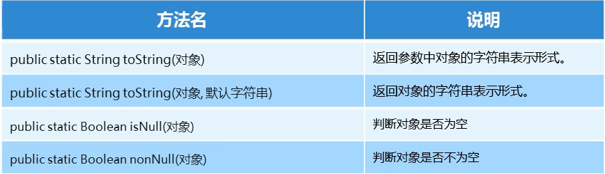

# 内部类

## 内部类概述

- 内部类：就是在一个类中定义一个类。举例：在一个 A 类的内部定义一个 B 类，B 类就被称为内部类

```java
public class Outer {
    public class Inner {

    }
}
```

- 内部类的访问特点
    - 内部类可以直接访问外部类成员，包括私有
    - 外部类要访问内部类的成员，必须创建对象

- 内部类在类中定义的位置不同，可以分为如下两种形式
    - 在类的成员位置：成员内部类
    - 在类的局部位置：局部内部类
- 成员内部类，外界如何创建对象使用呢？
    - 格式：外部类名.内部类名 对象名 = new 外部类对象().new 内部类对象();
    - 范例：Outer.Inner oi = new Outer().new Inner();

## 成员内部类

- 成员内部类，也属于（成员），既然是成员，就可以被一些修饰符所修饰
- private
    - 私有成员内部类访问：在自己所在的外部类中创建对象进行访问
- static
    - 静态成员内部类访问格式：外部类名.内部类名 对象名 = new 外部类名.内部类名();
    - 静态成员内部类中的静态方法：外部类名.内部类名.方法名();

## 局部内部类

- 局部内部类是在方法中定义的类，所以外界是无法直接使用，需要在方法内部创建对象并使用
- 该类可以直接访问外部类的成员，也可以访问方法内的局部变量

## 匿名内部类

- 概述：匿名内部类本质上是一个特殊的局部内部类（定义在方法内部）
- 前提：需要存在一个接口或类
- 格式：

```txt
new 类名或者接口名(){
    重写方法；
};
// 范例
new Inter() {
    public void show() {

    }
}
```

# Lambda 表达式

## 函数式编程思想概述

- 面向对象思想强调"必须通过对象的形式来做事情"
- 函数式思想则尽量忽略面向对象的复杂语法："强调做什么，而不是以什么形式去做"

## Lambda 表达式的标准格式

[LambdaTest](LambdaTest/TestSwimming.java)

- 匿名内部类中重写 swim()方法的代码分析
    - 方法形式参数为空，说明调用方法时不需要传递参数
    - 返回值类型为 void，说明方法执行没有结果返回
    - 方法体中的内容，是我们具体要做的事情
- Lambda 表达式的代码分析
    - ()：里面没有内容，可以看成是方法形式参数为空
    - ->：用尖头指向后面要做的事情
    - {}：包含一段代码，我们称之为代码块

- 组成 Lambda 表达式的三要素：形式参数，箭头，代码块

## Lambda 表达式的标准格式

- Lambda 表达式的格式
    - 格式：（形式参数） -> {代码块}
    - 形式参数：如果有多个参数，参数之间用逗号隔开；如果没有参数，留空即可
    - ->：由英文中画线和大于符号组成，固定写法。代表指向动作
    - 代码块：我们具体要做的事情，方法体中的内容

## Lambda 表达式的练习

- Lambda 表达式的使用前提
    - 有一个接口
    - 接口中有且仅有一个抽象方法

## Lambda 表达式的练习 2

- 首先存在一个接口（StringHandler）
- 在该接口中中存在一个抽象方法（printMessage），该方法是有参数无返回值
- 在测试类（StringHandlerDemo）中存在一个方法（useStringHandler）
- 方法的参数是 StringHandler 类型的，在方法内部调用了 StringHandler 的 printMessage 方法

## Lambda 表达式的练习 3

- 首先存在一个接口（RandomNumHandler）
- 在该接口中存在一个抽象方法（getNumber），该方法是无参数但是有返回值
- 在测试类中（RandomNumHandlerDemo）中存在一个方法（useRandomNumHanler），方法的参数是 RandomNumHandler 类型的，在方法内部调用了
  RandomNumHandler 的 getNumber 方法

## Lambda 表达式的练习 4

- 首先存在一个接口（Calculator）
- 在该接口中存在一个抽象方法（calc），该方法是有参数也有返回值
- 在测试类（CalculatorDemo）中存在一个方法（useCalculator），方法的参数是 Calculator 类型的，在方法内部调用了 Calculator 的
  calc 方法

## Lambda 表达式的省略模式

- 省略规则：
    - 参数类型可以省略，但是有多个参数的情况下，不能只省略一个
    - 如果参数有且仅有一个，那么小括号可以省略
    - 如果代码块的语句只有一条，可以省略大括号和分号，甚至是 return

## Lambda 表达式和匿名内部类的区别

- 所需类型不同
    - 匿名内部类：可以是接口，也可以是抽象类，还可以是具体类
    - Lambda 表达式：只能是接口
- 使用限制不同
    - 如果接口中有且仅有一个抽象方法，可以使用 Lambda 表达式，也可以使用匿名内部类
    - 如果接口中多于一个抽象方法，只能使用匿名内部类，而不能使用 Lambda 表达式
- 实现原理不同
    - 匿名内部类：编译之后，产生一个单独的.class字节码文件
    - Lambda表达式：编译之后，没有一个单独的.class字节码文件。对应的字节码会在运行的时候动态生成

# API

## 什么是 API？

- API(Application Programming interface) 应用程序接口
- 简单来说就是Java帮我们写好的方法，我们直接拿过来用就可以了。

## Math

- Math 包含执行基本数字运算的方法
  [Math](ApiMath/MathDemo.java)

## System

- System 不能被实例化
  [System](ApiSystem/SystemDemo.java)

| 方法名                                                         | 说明                                      |
|----------------------------------------------------------------|-------------------------------------------|
| public static void exit(int status)                            | 终止当前运行的Java虚拟机，非0表示异常终止 |
| public static long currentTimeMillis()                         | 返回当前时间（以毫秒为单位）              |
| arraycopy(数据源数组，起始索引，目的地数组，起始索引，拷贝个数 | 数组copy                                  |

## Object

- 每个类都可以将Object作为父类，所有类都直接或者间接的继承自该类
- 构造方法：public Object()
- 回想面向对象中，为什么说子类的构造方法默认访问的是父类的无参构造方法？
    - 因为它们的顶级父类只有无参构造方法

| 方法名                            | 说明                                                       |
|-----------------------------------|------------------------------------------------------------|
| public String toString()          | 返回对象的字符串表示形式。建议所有子类重写该方法，自动生成 |
| public boolean equals(另一个对象) | 比较对象是否相等，默认比较地址，重写可以比较内容，自动生成 |

### 结论

- Object 类是所有类的直接或者间接父类
- 直接打印一个对象就是打印这个对象的toString方法的返回值
- Object类的toString方法得到的是对象的地址值
- 我们一般会对toString方法进行重写

## Objects



## BigDecimal

- 构造方法

| 方法名                 | 说明         |
|------------------------|--------------|
| BigDecimal(double val) | 参数为double |
| BigDecimal(String val) | 参数为String |

### 常用方法

- 作用：可以用来精确计算

| 方法名                                                            | 说明 |
|-------------------------------------------------------------------|------|
| public BigDecimal add(另一个BigDecimal对象)                       | 加法 |
| public BigDecimal subtract(另一个BigDecimal对象)                  | 减法 |
| public BigDecimal multiply(另一个BigDecimal对象)                  | 乘法 |
| public BigDecimal divide(另一个BigDecimal对象)                    | 除法 |
| public BigDecimal divide(另一个BigDecimal对象, 精确几位,舍入模式) | 除法 |

### 结论

- BigDecimal是用来进行精确计算的
- 创建BigDecimal的对象，构造方法使用参数类型为字符串的
- 四则运算的除法，如果除不尽请使用divide的三个参数的方法
- 代码示例：
    - BigDecimal divide = bd1.divide(另一个BigDecimal对象, 精确几位,舍入模式);
    - 参数一：表示参数运算的另一个对象
    - 参数二：表示小数点后精确到多少位
    - 参数三：舍入模式
        - 进一法
        - 去尾法
        - 四舍五入
