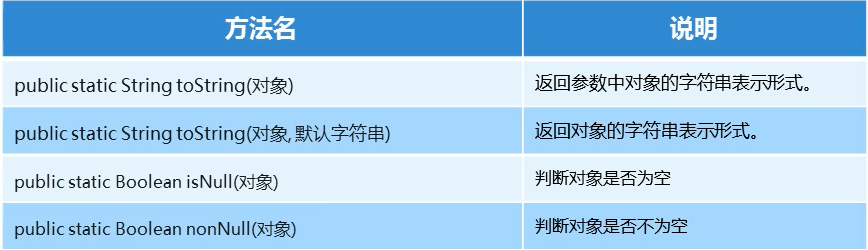

# API

## 什么是 API？

- API(Application Programming interface) 应用程序接口
- 简单来说就是Java帮我们写好的方法，我们直接拿过来用就可以了。

## Math

- Math 包含执行基本数字运算的方法
  [Math](ApiMath/MathDemo.java)

## System

- System 不能被实例化
  [System](ApiSystem/SystemDemo.java)

| 方法名                                                         | 说明                                      |
|----------------------------------------------------------------|-------------------------------------------|
| public static void exit(int status)                            | 终止当前运行的Java虚拟机，非0表示异常终止 |
| public static long currentTimeMillis()                         | 返回当前时间（以毫秒为单位）              |
| arraycopy(数据源数组，起始索引，目的地数组，起始索引，拷贝个数 | 数组copy                                  |

## Object

- 每个类都可以将Object作为父类，所有类都直接或者间接的继承自该类
- 构造方法：public Object()
- 回想面向对象中，为什么说子类的构造方法默认访问的是父类的无参构造方法？
    - 因为它们的顶级父类只有无参构造方法

| 方法名                            | 说明                                                       |
|-----------------------------------|------------------------------------------------------------|
| public String toString()          | 返回对象的字符串表示形式。建议所有子类重写该方法，自动生成 |
| public boolean equals(另一个对象) | 比较对象是否相等，默认比较地址，重写可以比较内容，自动生成 |

### 结论

- Object 类是所有类的直接或者间接父类
- 直接打印一个对象就是打印这个对象的toString方法的返回值
- Object类的toString方法得到的是对象的地址值
- 我们一般会对toString方法进行重写

## Objects

## BigDecimal

- 构造方法

| 方法名                 | 说明         |
|------------------------|--------------|
| BigDecimal(double val) | 参数为double |
| BigDecimal(String val) | 参数为String |

### 常用方法

- 作用：可以用来精确计算

| 方法名                                                            | 说明 |
|-------------------------------------------------------------------|------|
| public BigDecimal add(另一个BigDecimal对象)                       | 加法 |
| public BigDecimal subtract(另一个BigDecimal对象)                  | 减法 |
| public BigDecimal multiply(另一个BigDecimal对象)                  | 乘法 |
| public BigDecimal divide(另一个BigDecimal对象)                    | 除法 |
| public BigDecimal divide(另一个BigDecimal对象, 精确几位,舍入模式) | 除法 |

### 结论

- BigDecimal是用来进行精确计算的
- 创建BigDecimal的对象，构造方法使用参数类型为字符串的
- 四则运算的除法，如果除不尽请使用divide的三个参数的方法
- 代码示例：
    - BigDecimal divide = bd1.divide(另一个BigDecimal对象, 精确几位,舍入模式);
    - 参数一：表示参数运算的另一个对象
    - 参数二：表示小数点后精确到多少位
    - 参数三：舍入模式
        - 进一法
        - 去尾法
        - 四舍五入
