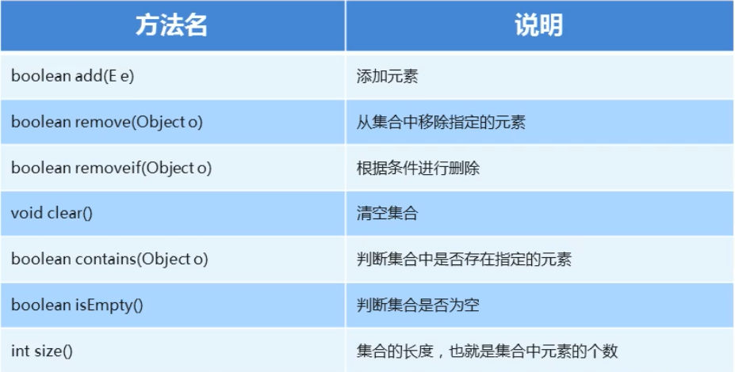
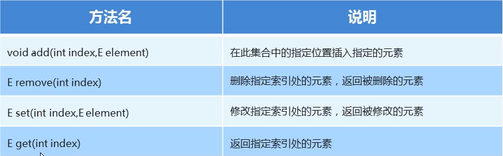
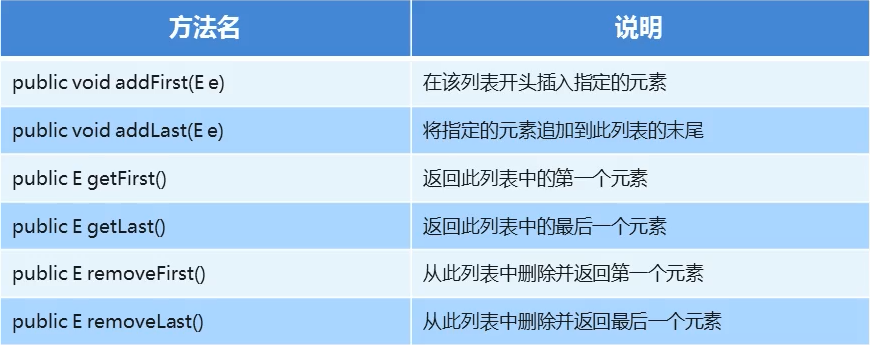

# 日期类

## Date 类概述和构造方法

- Date 代表了一个特定的时间，精确到毫秒
- 构造方法
	- public Date() 创建一个Date对象，表示默认时间
	- public Date(long date) 创建一个Date对象，表示指定时间
- 常用方法
	- public long getTime() 获取时间对象的毫秒值
	- public void setTime(long time) 设置时间，传递毫秒值

## SimpleDateFormat 类概述

- SimpleDateFormat 可以对Date对象，进行格式化和解析
- 常用的模式字母即对应关系如下：
	- y 年， M 月， d 日， H 时， m 分， s 秒

### SimpleDateFormat 格式化和解析日期

- 格式化（从 Date 到 String）
	- public final String format(Date date) 日期格式化为日期字符串
	- public Date parse(String source): 将字符串解析成日期

# Collection

## Collection 集合概述和使用

- Collection 集合概述
	- 是单例集合的顶层接口，他表示一组对象，这些对象也被成为Collection的元素
	- JDK不提供此借口的任何直接实现，他提供更具体的子接口（如Set和List）实现
- 创建Collection集合的对象
	- 多态的方式
	- 具体的实现类ArrayList
- Collection 集合常用方法
  

## Collection 集合的遍历

- Iterator: 迭代器，集合的专用遍历方式
	- Iterator<E> iterator(): 返回集合中的迭代器对象，该迭代器对象默认指向当前集合的0索引
- Iterator 常用方法
	- boolean hasNext(): 判断当前位置是否有元素可以被取出
	- E next(): 获取当前位置的元素，将迭代器对象移向下一个索引位置
- 迭代器中删除的方法
	- [练习](CollectionTest/CollectionCase.java)
- iterator 迭代器原理
	- 当创建完成指向某个集合或者容器的Iterator对象是，这是的指针其实指向的是第一个元素的上方，即指向一个 空
	- 当调用hasNext方法的时候，只是判断下一个元素的有无，并不移动指针
	- 当调用next方法的时候，向下移动指针，并且返回指针指向的元素，如果指针指向的内存中没有元素，会报异常。
	- remove方法删除的元素是指针指向的元素。如果当前指针指向的内存中没有元素，那么会抛出异常。

## 增强for循环

- 增强for：简化数组和collection集合的遍历
- JDK5之后出现，内部原理是一个迭代器
- 实现Iterable接口的类才可以使用迭代器和增强for

```java
class Example {
    public static void main(String[] args) {
        int[] arr = {1, 2, 3, 4, 5, 6};
        for (int i : arr) {
            System.out.println(i);
        }
    }
}
```

## 三种循环的使用场景

- 如果需要操作索引，使用普通for循环
- 如果在遍历的过程中需要删除元素，请使用迭代器
- 如果仅仅想遍历，那么使用增强for

## 案例

- 需求：创建一个Collection集合存储学生对象的集合，存储3个学生对象，在控制台遍历该集合
- [案例](CollectionTest/CollectionCase2.java)

# List

## List集合概述和特点

- List集合概述
	- 有序集合，这里的有序指存取顺序
	- 用户可以精确控制列表中每个元素的插入位置，用户可以通过证书索引访问元素，并搜索列表中的元素
- List集合特点
	- 有序：存储和取出的元素顺序一致
	- 有索引：可以通过索引操作元素
	- 可重复：存储的元素可以重复

## List集合特有方法



## 数据结构

- 数据结构是计算机存储、组织数据的方式，是指相互之间存在一种或多种特定关系的数据元素的集合
- 栈，先进后出
- 队列，先进先出
- 数组，查询快，增删改慢
	- 查询数据通过地址值和索引定位，查询任意数据耗时相同，查询速度快
	- 删除数据时，要将原始数据删除，同时后面每个数据前移，删除效率低
	- 添加数据时，添加位置后的每一个数据后移，再添加元素，添加效率低

### 链表

- 单向链表
	- 一个节点：数据，下一个节点的地址值
	- 增删快的模型（对比数组）
- 双向链表
	- 一个节点：上一个数据地址值，数据，下一个数据地址值
	- 判断查询数据离头还是离尾近

### ArrayList 源码解析

- ArrayList：底层结构是数组，查询快增删慢
- 空参构造：对应数组长度为0
- 底层数组添加数据后默认长度为10
- 默认 size 成员变量 指向0索引，添加完成后指向下一个空索引

### List集合常用实现类

- List集合常用子类：ArrayList，LinkedList
	- ArrayList：底层数据结构是数组，查询快，增删慢
	- LinkedList：底层数据结构是链表，查询慢，增删快
- 练习：使用LinkedList完成存储字符串并遍历
	- [LinkedList](ListTest/LinkedListTest.java)

### LinkedList 集合的特有功能

