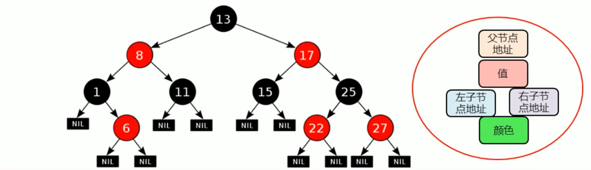
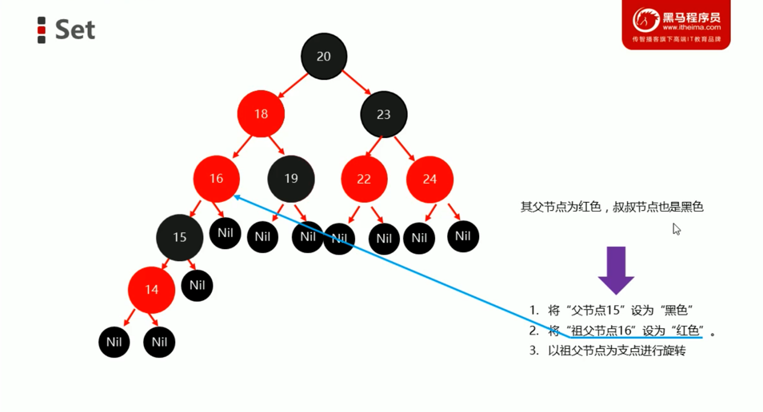

# 范型

## 范型概述

- 范型：是JDK5中引入的特性，他提供了编译时类型安全检测机制
- 范型的好处：
	- 把运行时期的问题提前到了编译期间
	- 避免了强制类型转换

# 集合体系结构

## Collection 单列

- List 可重复
	- ArrayList
	- LinkedList
- Set 不可重复
	- HashSet
	- TreeSet

## Set 集合概述和特点

- Set 集合特点
	- 可以去除重复
	- 存取顺序不一致
	- 没有带索引的方法，所以不能使用普通for循环遍历，也不能通过索引来获取，删除Set集合里的元素
- Set 集合练习
	- 存储字符串并遍历

### TreeSet 集合概述和特点

- TreeSet集合特点
	- 不包含重复元素的集合
	- 没有带索引的方法
	- 可以将内部元素进行排序
- TreeSet集合练习
	- [存储Integer类型的整数，并遍历](TreeSetTest/TreeSetTest1.java)
	- [存储Student对象，并遍历](TreeSetTest/TreeSetTest2.java)
- ***想要使用TreeSet集合，必须制定排序规则***

### 自然排序 Comparable 的使用

- 使用空参构造创建TreeSet集合
- 自定义学生类中实现Comparable接口
- 重写里面的compareTo方法

- 自然排序简单原理图
	- 如果返回值是负数，表示当前存入的元素是较小值，存左边
	- 如果返回值是0，表示当前存入的元素跟集合中元素重复了，不存
	- 如果返回值是正数，表示当前存入的元素是较大值，存右边

### 比较器排序 Comparator 的使用

- TreeSet的带参构造方法使用的是比较器排序对元素进行排序的
- 比较器排序，就是让集合构造方法接收 Comparator 的实现类对象，重写 compare(T o1, T o2) 方法
- 重写方法时，一定要注意排序规则必须按照主要条件和次要条件来写

- [练习](TreeSetTest/TreeSetTest4.java)
	- 自定义Teacher老师类，属性为姓名和年龄
	- 请按照年龄排序，如果年龄一样
	- 则按照姓名排序，姓名用英文表示

### 两种方式小结

- 自然排序：自定义实现类Comparable接口，重写compareTo方法，根据返回值进行排序
- 比较器排序：创建TreeSet对象时传递Comparator的实现类对象，重写compare方法，根据返回值排序
- 使用的时候，默认自然排序，当自然排序不满足需求的时候，使用比较器排序

#### 两种方式中，关于返回值的规则

- 如果返回值是负数，表示当前存入的元素是较小值，存左边
- 如果返回值是0，表示当前存入的元素跟集合中元素重复了，不存
- 如果返回值是正数，表示当前存入的元素是较大值，存右边
- [按照字符串长短进行排序](TreeSetTest/TreeSetTest5.java)

### 数据结构

#### 平衡二叉树

- 二叉树左右两个子树的高度差不超过1
- 任意节点的左右两个子树都是一颗平衡二叉树
- 平衡二叉树
	- 左旋：将根结点的左侧往左拉，右子节点变成了新父结点，并把多余的左子结点出让，给已降级的根结点当右子结点
	- 右旋：将根结点的右侧往右拉，左子节点成了新的父节点，并把多余的右子节点出让，给已降级的根结点当左子节点
	- 触发时机：当添加一个节点后，该树不再是一个平衡二叉树
	- 左左
		- 当根结点左子树的左子树有节点插入，导致二叉树不平衡
	- 左右
		- 当根结点左子树的右子树有节点插入，导致二叉树不平衡
	- 右右
		- 当根结点右子树的右子树有节点插入，导致二叉树不平衡
	- 右左
		- 当根结点右子树的左子树有节点插入，导致二叉树不平衡

#### 红黑树

- 红黑树是一种自平衡的二叉查找树，是计算机科学中用到的一种数据结构
- 平衡二叉树是高度平衡的：
	- 条件：当左右子树高度差超过 1 -> 旋转
- 红黑树是二叉查找树：
	- 不是高度平衡的
	- 每一个节点可以是红或者黑
	- 条件：自己的红黑规则 -> 旋转
- 红黑规则
	1. 每个节点都是红色或者黑色的。
	2. 根结点必须是黑色的
	3. 如果一个节点没有子节点或者父节点，则该节点对应的指针属性为Nil，这些Nil视为叶节点，每个叶节点Nil是黑色的
	4. 如果某个节点是红色的，那么它的子节点必须是黑色（不能出现两个红色节点相连的情况）
	5. 对每个节点，从该节点到其所有后代节点的简单路径上，均包含相同数目的黑色节点

- 添加节点
	- 添加的节点的颜色，可以是红色，也可以是黑色的

