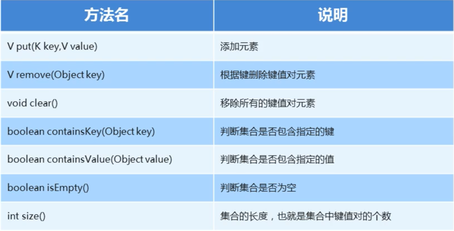

# Set

## HashSet 集合概述和特点

### HashSet 集合特点

- 底层数据结构是哈希表
- 不能保证存储和取出的数据顺序完全一致
- 没有带索引的方法，不能使用普通for遍历
- 由于是Set集合，元素唯一

### HashSet 集合练习

- [存储字符串并遍历](HashSetTest/HashSetTest.java)
- [HashSet存储学生对象并遍历](HashSetTest)

## 哈希值

- 哈希值（哈希码值）：是JDK根据对象的地址或者属性值，算出来的int类型的整数
- Object 类中有一个方法可以获取对象的哈希值
	- public int hashCode(): 根据对象的地址值计算出来的哈希值
- 如果没有重写hashCode方法，那么是根据对象的地址值计算出的哈希值
	- 同一个对象多次调用hashCode方法，返回值相同
	- 不同对象返回值不一样
- 如果重写了hashCode方法，一般是通过对象的属性值计算出哈希值
	- 如果不同对象的属性值是一样的，那么计算出的哈希值也是一样的

## 常见数据结构之哈希表

- JDK8之前，底层采用数组+链表实现
	- 默认长度16，默认加载因子0.75，数组名为table
	- 根据元素哈希值和数组长度计算应存入位置
	- 判断当前位置是否为null，如果是null直接存入
	- 如果存入位置不为null，表示有元素，则调用equals方法比较属性值
	- 如果一样，则不存，如果不一样，则存入数组，老元素则挂在新元素下面
	- 当数组存入了16*0.75=12个元素的时候，数组就会扩容为原先的两倍
- JDK8之后，底层进行了优化，由数组+链表+红黑树实现

# Map

## Map 集合概述和使用

- 一次存一对数据，键值对
- Interface Map<K,V> K: 键的数据类型，V: 值的数据类型
- 键不能重复，值可以重复
- 键和值是一一对应的
- Java中键值对叫做Entry对象
- 创建Map集合的对象
	- 多态的方式
	- 具体实现类HashMap
- [举例](MapTest/MapTest.java)

## Map 集合的基本功能

## Map 集合的获取功能

| 方法名                            | 说明           |
|--------------------------------|--------------|
| Set<Map.Entry<K,V>> entrySet() | 获取所有键值对对象的集合 |
| Set<K> KeySet()                | 获取所有键的集合     |
| V get(Object key)              | 根据键获取值       |

## HashMap

### HashMap的特点

- 是Map里的一个实现类
- 没有额外需要学习的方法，直接使用Map里的方法就可以了
- HashMap和HashSet一样底层是哈希表结构的

### HashMap小结

- 底层是Hash表结构
- 依赖hashCode方法和equals方法保证键的唯一
- 如果键要存储的是自定义对象，需要重写hashCode和equals方法
- [案例](MapTest/MapTest5.java);
	- 学生对象和籍贯键值对

## TreeMap

### TreeMap特点

- TreeMap是Map里面的一个实现类
- 没有额外需要学习的特有方法，直接使用Map里面的方法就可以了
- TreeMap 和 TreeSet 底层都是红黑树结构
- 依赖自然排序和比较器排序，对键进行排序
- 如果键存储的是自定义对象，需要实现Comparable接口或者在创建TreeMap对象时候给出比较器排序规则

### TreeMap练习

- [创建TreeMap集合，键是学生对象，值是籍贯，按照年龄排序并遍历](TreeMapTest/TreeMapTest.java)

# 可变参数

- 可变参数：就是形参的个数是可以发生变化的
	- 格式：修饰符返回值类型 方法名(数据类型...变量名){}
	- 范例：public static int sum(int...a){}
- 可变参数注意事项
	- 这里的变量其实是一个数组
	- 如果一个方法有多个参数，包含可变参数，可变参数放到最后

## 案例

- [需求](VariableParameter/MyVariableParameter.java)
	- 定义一个方法，求两个数的和
	- 定义一个方法，求三个数的和
	- [定义一个方法，求 N 个数的和](VariableParameter/MyVariableParameter2.java)

# 创建不可变集合

## 方法

| 方法名                                      | 说明                |
|------------------------------------------|-------------------|
| static <E> List<E> of(E...elements)      | 创建一个具有指定元素的List对象 |
| static <E> Set<E> of(E...elements)       | 创建一个具有指定元素的Set对象  |
| static <K, V> Map<K, V> of(E...elements) | 创建一个具有指定元素的Map对象  |

- 在 List、Set、Map 接口中，都存在of方法，可以创建一个不可变的集合
- 这个集合不能添加、不能删除、不能修改
- 但是可以结合集合的带参构造，实现集合的批量添加
- 在Map接口中，还有一个ofEntries方法可以提高代码的阅读性
- 首先会把键值对封装成一个Entry对象，再把这个Entry对象添加到集合中