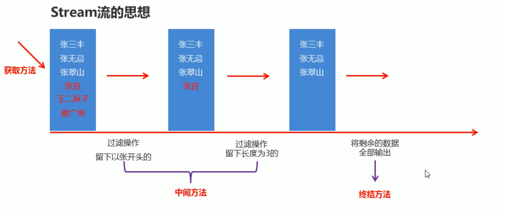
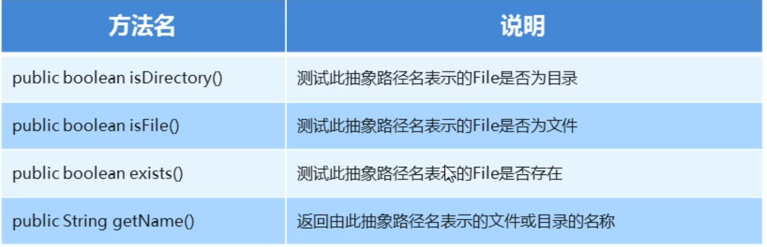

# Stream 流

## Stream 流思想

## Stream 流三类方法

- 获取Stream流
	- 创建一条流水线，并把数据放到流水线上准备进行操作
- 中间方法
	- 流水线上的操作
	- 一次操作完毕后，还可以继续进行其他操作
- 终结方法
	- 一个Stream流只能有一个终结方法
	- 是流水线上的最后操作

## Stream 流的获取方法

- 单列集合
	- 可以使用Collection接口中的默认方法stream()生成流
	- default Stream<E> stream()
- 双列集合
	- 间接的生成流
	- 可以先通过keySet或者entrySet获取一个Set集合，再获取Stream流
- 数组
	- Arrays中的静态方法stream生成流
- 同种数据类型的多个数据
	- 使用 Stream.of(T...values)生成流

## Stream 流中的常见中间方法

- Stream<T> filter(Predicate predicate)：用于对流中的数据进行过滤
	- Predicate接口中的方法
	- boolean test(T t):对给定的参数进行判断，返回一个布尔值
- Stream<T> limit(long maxSize)：截取指定参数个数的数据
	- 截取前 maxSize 个参数
- Stream<T> skip(long n)：跳过指定参数个数的数据
- static <T> Stream<T> concat(Stream a, Stream b)：合并a，b两个为一个流
- Stream<T> distinct()：去除流中重复元素。依赖hashCode和equals方法

## Stream 流常见的终结方法

- void forEach(Consumer action)：对此流的每个元素执行操作
	- Consumer 接口中的方法 void accept(T t): 对给定的参数执行此操作
- long count()：返回此流中的元素数

## Stream 流的收集操作

- [需求：过滤元素并遍历集合](StreamTest/StreamTest6.java)
	- 定义一个集合，并添加一些整数1, 2, 3, 4, 5, 6, 7, 8, 9, 10
	- 将集合中的奇数删除，只保留偶数
	- 遍历集合得到2, 4, 6, 8, 10
- 在 Stream 流里面，无法修改集合，数组，等数据源中的数据
- 使用 Stream 流的方式操作完毕之后，想把流中的数据收集起来，该怎么办呢
- Stream 流收集方法
	- R collect(Collector collector)
	- 工具类Collectors提供了具体的收集方式
	- public static <T> Collector toList()：把元素收集到List集合中
	- public static <T> Collector toSet()：把元素收集到Set集合中
	- public static Collector toMap(Function keyMapper, Function valueMapper)：把元素收集到Map集合中

## Stream 流练习

- 现有两个 ArrayList 集合，分别有 6 名男演员和 6 名女演员，要求完成如下操作
	- 男演员只要名字为 3 个字的前两人
	- 女演员只要姓杨的，且不要第一个
	- 把过滤后的男演员和女演员合并到一起
	- 把上一步操作后的元素为构造方法的参数创建演员对象，遍历数据
	- 演员类 Actor 里要有成员变量，一个带参构造，以及成员对应的 get/set 方法

# File

- IO 是什么？
	- 可以将数据从本地文件中读取出来
	- 可以将数据从内存保存到本地文件
- File 类是什么？
	- 在读写文件时告诉虚拟机要操作的文件/文件夹在哪里？
	- 对文件夹/文件进行操作，包括创建，删除等

## File 类和构造方法

- File: 是文件和目录路径名和抽象表示
	- 文件和目录可以通过File封装成对象
	- File 封装的对象仅仅是一个路径名，它可以是存在的，也可以是不存在的

| 方法名                               | 说明                          |
|-----------------------------------|-----------------------------|
| File(String pathname)             | 通过指定路径名字转换为抽象路径名来创建新的File实例 |
| File(String parent, String child) | 从父路径名字符串和子路径名字符串创建新的File实例  |
| File(File parent, String child)   | 从父抽象路径名和子路径名字符串创建新的File实例   |

## 绝对路径和相对路径

- 绝对路径：从盘符开始
- 相对路径：相对当前目录下的路径

## File 类创建功能

| 方法名                            | 说明        |
|--------------------------------|-----------|
| public boolean createNewFile() | 创建一个新的文件  |
| public boolean mkdir()         | 创建一个新的文件夹 |
| public boolean mkdirs()        | 创建多级目录    |

## File 类删除功能

- public boolean delete() 删除此抽象路径名表示的文件或目录

## File 判断和获取功能

## File 高级获取功能

- public File[] listFiles() 返回此抽象路径名表示的目录中的文件和目录的File对象数组
- 注意事项
	- 当调用者是一个文件时
		- 返回 null
	- 当调用者是一个空文件夹时
		- 返回长度为0的File数组
	- 当调用者是一个有内容的文件夹时
		- 返回内容
	- 当调用者是一个有权限才能进入的文件夹时
		- 返回 null

## File 练习

- 练习一
	- 在当前模块下的aaa文件夹中创建一个a.txt文件