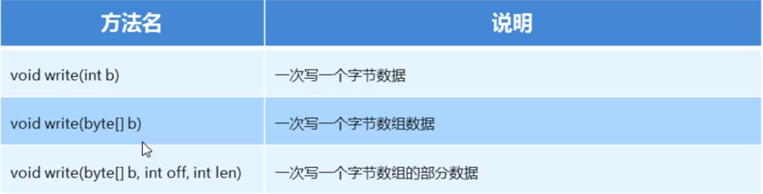

# IO

## IO 流的概述和分类

- 存储在内存，运行完成就丢失
- 学习IO目的
	- 将数据写入到文件中，实现数据永久化存储
	- 读取文件中存在的数据
- IO 流技术选型
	- 纯文本文件用字符流打开
	- 非纯文本文件用字节流打开

## 字节流

### 字节流写数据

- 生成随机数步骤
	- 创建Random对象
	- 调用随机数生成方法
- 字节流写数据步骤
	- 创建字节流输出对象
		- 如果文件存在就清空，不存在就创建
	- 写数据
		- 写出的整数，实际上写出的是整数在码表上对应的字母
	- 释放资源
		- 每次使用完流必须释放资源
- 字节流写数据3种方式
  
- 字节流写数据两个小问题
	- 如何实现换行
		- 写完数据加换行符
- 字节流如何实现追加写入
	- FileOutputStream(String name, boolean append)
	- 创建文件输出流以指定名称写入文件，第二个参数表示追加写入

#### 字节流写入数据加 try...catch 异常处理

- 异常处理标准格式
- try..catch...finally

### 字节流读取数据

- 一次读一次数据
- 一次读完文件使用 while 循环
	- 判断 read 是否读完，等于 -1
- [案例：复制文件](outputDemo/CopyFileCase.java)
- 如果操作的文件过大，速度会不会有影响
	- 提高拷贝速度解决方案
	- 创建字节数组，可以一次读多个数据
	- public int read(byte[] b)：从输入流读取最多 b.length 个字节的数据
	- 返回的是读入缓冲区的总字节数，也就是实际的读取字节的个数

### 字节缓冲流

- BufferOutputStream：字节缓冲输出流
- BufferInputStream：字节缓冲输入流
- 构造方法：
	- 字节缓冲输出流：BufferedOutputStream(OutputStream out)
	- 字节缓冲输入流：BufferedInputStream(InputStream in)
- 为什么构造方法需要的字节流，而不是具体的文件或者路径呢
	- 字节缓冲流仅仅提供缓冲区，真正读写数据还得依靠基本的字节流对象进行操作

### 小结

- 字节流：可以操作（拷贝）所有类型的文件
- 字节缓冲流：
	- 可以提高效率，不能直接操作文件，需要传递字节流
- 拷贝文件四种方式
	- 字节流一次读写一个字节
	- 字节流一次读写一个字节数组
	- 字节缓冲流一次操作一个字节
	- 字节缓冲流一次操作一个字节数组

## 字符流
