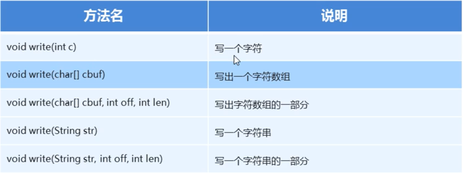
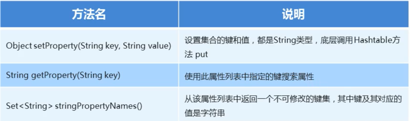
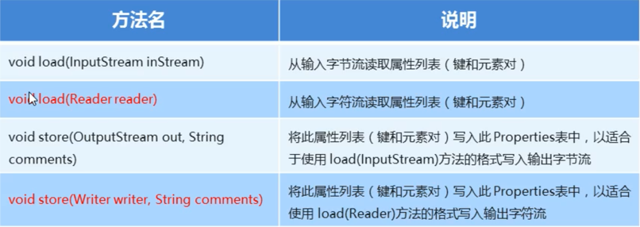

# 字符流

## 编码表

- 基础知识：
	- 计算机中存储的信息都是用二进制数表示的
	- 按照某种规则，将字符变为二进制，再存储到计算机中，称为编码
	- 按照同样的规则，将二进制数解析显示出来，称为解码
	- 编码和解码的方式必须一致，否则会导致乱码
		- 存储一个字符a，首先需在码表中查到对应的数字是97，然后转化成二进制进行存储
		- 读取的时候，先把二进制解析出来，再转换成97，通过97查到对应的字符是a
- ASCII 字符集
	- 包含了常见的标点符号，大小写字符，数字
	- 码表是没有中文的
- GBK 码表
	- window默认码表，包含汉字和ASCII码表
	- 一个中文两个字节方式存储
- Unicode 万国码表
	- 支持大多数常见符号和文字
	- 一个中文三个字节方式存储

## 字符串中的编码问题

- 编码：
	- byte[] getBytes()：使用平台默认字符集将该String编码为一系列字节，将结果存储到新的字节数组中
	- byte[] getBytes(String charsetName)：使用指定的字符集将该String编码为一系列字节，将结果存储到新的字节数组中
- 解码：
	- String(byte[] bytes)：通过平台默认字符集解码指定的字节数组来构造新的String
	- String(byte[] bytes, String charsetName)：通过指定的字符集解码指定的字节数组来构造新的String

## 为什么字节流读文本文件可能乱码？

- 因为字节流一次处理一个字节，而不管是GBK还是UTF-8的中文多是多个字节，字节流一次只能处理其中的一部分，所以会出现乱码问题

## 字符流读取中文过程

- 字符流=字节流+编码表
- 基础知识：
	- 不管是在哪个码表中，中文的第一个字节一定是一个负数

## 小结

- 想要进行拷贝，一律使用字节流或者字节缓冲流
- 想要把文本文件中的数据读到内存中，使用字符输入流
- 想要把内存中的数据写到文本文件中，使用字符输出流
- GBK 码表一个中文两个字节， Unicode 的 UTF-8 中 一个中文三个字节

## 字符流写数据

- 字符流写数据
- 步骤：
	- 创建字符输出对象
		- 注意事项
			- 文件不存在就自动创建，要保证父目录存在
			- 如果文件存在就清空
	- 写数据
		- 注意事项：
			- 写出int类型整数，实际写出的是整数在码表上对应的字母
			- 写出字符串数据，是把字符串原样写出
	- 释放资源
		- 注意事项：
			- 每次使用完必须要释放资源

### 字符流写数据五种方式

## flush 和 close 方法

| 方法名     | 说明                               |
|---------|----------------------------------|
| flush() | 刷新流，还可以继续写数据                     |
| close() | 关闭流，释放资源，但是在关闭之前会刷新流，一旦关闭，就不能写数据 |

## 字符流的 2 种读取方式

- FileReader()
	- 一次读取一个字符
	- 一次读取多个字符

## 案例

- [保存键盘录入的用户名和密码实现永久存储](charstream/CharStreamCase.java)
	- 要求用户名独占一行，密码独占一行

## 字符缓冲流

- BufferedWriter：将字符高效写出
- BufferedReader：将字符高效读取

### 字符缓冲流特有功能

- BufferedWriter
	- void newLine(): 写一行行分隔符，行分隔符字符串由系统属性定义
- BufferedReader
	- public String readLine(): 读一行文字，包含行的内容的字符串，不包括任何行终止字符，如果流的结尾已经到达，则为 null

## 案例

- [读取文件中的数据，排序后再次写到本地文件](charstream/CharStreamCase2.java)

# 其他流

### 转换流

- 输入，输出
- InputStreamReader OutputStreamWriter

### 对象操作流

- 特点
	- 将对象以字节的形式写到本地文件中
- 输入，输出
	- ObjectOutputStream ObjectInputStream
- 对象操作输出流
	- 对象序列化流：就是将对象写到本地文件中，或者在网络中传输对象
	- 对象反序列化流：把写到本地文件中的对象读取到内存中，或者接收网络中传输的对象
- 如果一个对象中的某个变量不想被序列化，怎么办
	- 加上 transient 修饰
	- 这样对象操作流读出变量的值为空

#### 案例

- [创建多个 JavaBean 对象，写到文件中，再次读取到内存](convertDemo/ConvertCase.java)
	- 创建学生对象
	- 利用对象操作输出流写到本地
	- 利用对象操作输入流读到内存

### Properties

#### Properties 概述

- 是一个 Map 体系的集合类
- Properties 中有跟IO相关的方法
- 键值对的数据类型基本都定义为字符串

#### 练习

- [Properties 作为 Map 集合的使用](propertiesDemo/PropertiesDemo.java)

#### 特有方法

- 与 IO 结合的方法
  