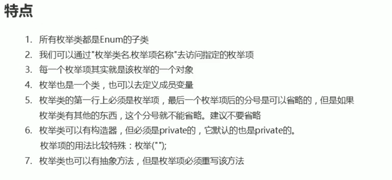

# 网络编程入门

## 网络编程概述

- 网络编程
	- 在网络通信协议下，不同计算机上运行的程序，可以进行数据传输
- 网络编程器三要素
	- IP地址
		- 设备在网络中的地址，是唯一的标识
	- 端口
		- 应用程序在设备中的唯一标识
	- 协议
		- 数据在网络中传输的规则，常见的协议有UDP协议和TCP协议
- IP
	- 互联网协议地址
	- IPv6：128位地址长度，分成8组
- IP 地址
	- 常用命令：
	- ipconfig: 查看本机IP地址
	- ping IP地址: 检查网络是否连通
- 特殊IP地址：
	- 127.0.0.1: 是回送地址也称本地回环地址，可以代表本机的IP地址，一般用来测试使用
- InetAddress 的使用
	- 为了方便我们对IP地址的获取和操作，Java提供了一个类InetAddress供我们使用
	- InetAddress 此类表示Internet协议IP地址

| 方法名                                       | 说明                                |
|-------------------------------------------|-----------------------------------|
| static InetAddress getByName(String host) | 确定主机名称的IP地址，主机名称可以是及机器名称，也可以是IP地址 |
| String getHostName()                      | 获取此IP地址的主机名                       |
| String getHostAddress()                   | 返回文本显示中的IP地址字符串                   |

## 端口和协议

- 端口
	- 设备上应用程序的唯一标识
- 端口号
	- 用两个字节表示的整数，它的取值范围是0~65535。
	- 其中，0~1023之间的端口号用于一些知名的网络服务和应用，普通的应用程序需要使用1024以上的端口号
	- 注意：一个端口号只能被一个应用程序使用
- 协议
	- 协议：计算机网络中，连接和通信的规则被称为网络通信协议
- UDP协议
	- 用户数据报协议(User Datagram Protocol)
	- UDP是无连接通信协议，即在数据传输时，数据的发送端和接收端不建立逻辑连接，简单来说，当一台计算机向另外一台计算机发送数据时
	- 发送端不会确认接收端是否存在，就会发出数据

## 小结

- 网络编程：就是可以让两台计算机进行数据交互
- 网络编程三要素：
	- IP：设备在网络中的唯一标识
	- 端口号：应用程序在设备中唯一的标识
	- 协议：数据在传输过程中遵守的规则

## 2.UDP通信程序

### 2.1 UDP发送数据【应用】

- Java中的UDP通信

	- UDP协议是一种不可靠的网络协议，它在通信的两端各建立一个Socket对象，但是这两个Socket只是发送，接收数据的对象，因此对于基于UDP协议的通信双方而言，没有所谓的客户端和服务器的概念
	- Java提供了DatagramSocket类作为基于UDP协议的Socket

- 构造方法

| 方法名                                                      | 说明                                                 |
| ----------------------------------------------------------- | ---------------------------------------------------- |
| DatagramSocket()                                            | 创建数据报套接字并将其绑定到本机地址上的任何可用端口 |
| DatagramPacket(byte[] buf,int len,InetAddress add,int port) | 创建数据包,发送长度为len的数据包到指定主机的指定端口 |

- 相关方法

| 方法名                         | 说明                   |
| ------------------------------ | ---------------------- |
| void send(DatagramPacket p)    | 发送数据报包           |
| void close()                   | 关闭数据报套接字       |
| void receive(DatagramPacket p) | 从此套接字接受数据报包 |

- 发送数据的步骤
	- 创建发送端的Socket对象(DatagramSocket)
	- 创建数据，并把数据打包
	- 调用DatagramSocket对象的方法发送数据
	- 关闭发送端

- 代码演示

  ```java
  public class SendDemo {
      public static void main(String[] args) throws IOException {
          //创建发送端的Socket对象(DatagramSocket)
          // DatagramSocket() 构造数据报套接字并将其绑定到本地主机上的任何可用端口
          DatagramSocket ds = new DatagramSocket();
  
          //创建数据，并把数据打包
          //DatagramPacket(byte[] buf, int length, InetAddress address, int port)
          //构造一个数据包，发送长度为 length的数据包到指定主机上的指定端口号。
          byte[] bys = "hello,udp,我来了".getBytes();
  
          DatagramPacket dp = new DatagramPacket(bys,bys.length,InetAddress.getByName("127.0.0.1"),10086);
  
          //调用DatagramSocket对象的方法发送数据
          //void send(DatagramPacket p) 从此套接字发送数据报包
          ds.send(dp);
  
          //关闭发送端
          //void close() 关闭此数据报套接字
          ds.close();
      }
  }
  ```

### 2.2UDP接收数据【应用】

- 接收数据的步骤

	- 创建接收端的Socket对象(DatagramSocket)
	- 创建一个数据包，用于接收数据
	- 调用DatagramSocket对象的方法接收数据
	- 解析数据包，并把数据在控制台显示
	- 关闭接收端

- 构造方法

| 方法名                              | 说明                                            |
| ----------------------------------- | ----------------------------------------------- |
| DatagramPacket(byte[] buf, int len) | 创建一个DatagramPacket用于接收长度为len的数据包 |

- 相关方法

| 方法名            | 说明                                     |
| ----------------- | ---------------------------------------- |
| byte[]  getData() | 返回数据缓冲区                           |
| int  getLength()  | 返回要发送的数据的长度或接收的数据的长度 |

- 示例代码

```java
public class ReceiveDemo {
    public static void main(String[] args) throws IOException {
        //创建接收端的Socket对象(DatagramSocket)
        DatagramSocket ds = new DatagramSocket(12345);

        //创建一个数据包，用于接收数据
        byte[] bys = new byte[1024];
        DatagramPacket dp = new DatagramPacket(bys, bys.length);

        //调用DatagramSocket对象的方法接收数据
        ds.receive(dp);

        //解析数据包，并把数据在控制台显示
        System.out.println("数据是：" + new String(dp.getData(), 0, dp.getLength()));
    }
}
```

### 2.3UDP通信程序练习【应用】

- 案例需求

  UDP发送数据：数据来自于键盘录入，直到输入的数据是886，发送数据结束

  UDP接收数据：因为接收端不知道发送端什么时候停止发送，故采用死循环接收

- 代码实现

```java
/*
  UDP发送数据：
	  数据来自于键盘录入，直到输入的数据是886，发送数据结束
*/
public class SendDemo {
    public static void main(String[] args) throws IOException {
        //创建发送端的Socket对象(DatagramSocket)
        DatagramSocket ds = new DatagramSocket();
        //键盘录入数据
        Scanner sc = new Scanner(System.in);
        while (true) {
            String s = sc.nextLine();
            //输入的数据是886，发送数据结束
            if ("886".equals(s)) {
                break;
            }
            //创建数据，并把数据打包
            byte[] bys = s.getBytes();
            DatagramPacket dp = new DatagramPacket(bys, bys.length, InetAddress.getByName("192.168.1.66"), 12345);

            //调用DatagramSocket对象的方法发送数据
            ds.send(dp);
        }
        //关闭发送端
        ds.close();
    }
}

/*
  UDP接收数据：
	  因为接收端不知道发送端什么时候停止发送，故采用死循环接收
*/
public class ReceiveDemo {
    public static void main(String[] args) throws IOException {
        //创建接收端的Socket对象(DatagramSocket)
        DatagramSocket ds = new DatagramSocket(12345);
        while (true) {
            //创建一个数据包，用于接收数据
            byte[] bys = new byte[1024];
            DatagramPacket dp = new DatagramPacket(bys, bys.length);
            //调用DatagramSocket对象的方法接收数据
            ds.receive(dp);
            //解析数据包，并把数据在控制台显示
            System.out.println("数据是：" + new String(dp.getData(), 0, dp.getLength()));
        }
        //关闭接收端
//        ds.close();
    }
}
```

### 2.4UDP三种通讯方式【理解】

+ 单播

  单播用于两个主机之间的端对端通信

+ 组播

  组播用于对一组特定的主机进行通信

+ 广播

  广播用于一个主机对整个局域网上所有主机上的数据通信

### 2.5UDP组播实现【理解】

+ 实现步骤

	+ 发送端
		1. 创建发送端的Socket对象(DatagramSocket)
		2. 创建数据，并把数据打包(DatagramPacket)
		3. 调用DatagramSocket对象的方法发送数据(在单播中,这里是发给指定IP的电脑但是在组播当中,这里是发给组播地址)
		4. 释放资源
	+ 接收端
		1. 创建接收端Socket对象(MulticastSocket)
		2. 创建一个箱子,用于接收数据
		3. 把当前计算机绑定一个组播地址
		4. 将数据接收到箱子中
		5. 解析数据包,并打印数据
		6. 释放资源

+ 代码实现

```java
// 发送端
public class ClinetDemo {
    public static void main(String[] args) throws IOException {
        // 1. 创建发送端的Socket对象(DatagramSocket)
        DatagramSocket ds = new DatagramSocket();
        String s = "hello 组播";
        byte[] bytes = s.getBytes();
        InetAddress address = InetAddress.getByName("224.0.1.0");
        int port = 10000;
        // 2. 创建数据，并把数据打包(DatagramPacket)
        DatagramPacket dp = new DatagramPacket(bytes, bytes.length, address, port);
        // 3. 调用DatagramSocket对象的方法发送数据(在单播中,这里是发给指定IP的电脑但是在组播当中,这里是发给组播地址)
        ds.send(dp);
        // 4. 释放资源
        ds.close();
    }
}

// 接收端
public class ServerDemo {
    public static void main(String[] args) throws IOException {
        // 1. 创建接收端Socket对象(MulticastSocket)
        MulticastSocket ms = new MulticastSocket(10000);
        // 2. 创建一个箱子,用于接收数据
        DatagramPacket dp = new DatagramPacket(new byte[1024], 1024);
        // 3. 把当前计算机绑定一个组播地址,表示添加到这一组中.
        ms.joinGroup(InetAddress.getByName("224.0.1.0"));
        // 4. 将数据接收到箱子中
        ms.receive(dp);
        // 5. 解析数据包,并打印数据
        byte[] data = dp.getData();
        int length = dp.getLength();
        System.out.println(new String(data, 0, length));
        // 6. 释放资源
        ms.close();
    }
}
```

### 2.6UDP广播实现【理解】

+ 实现步骤

	+ 发送端
		1. 创建发送端Socket对象(DatagramSocket)
		2. 创建存储数据的箱子,将广播地址封装进去
		3. 发送数据
		4. 释放资源
	+ 接收端
		1. 创建接收端的Socket对象(DatagramSocket)
		2. 创建一个数据包，用于接收数据
		3. 调用DatagramSocket对象的方法接收数据
		4. 解析数据包，并把数据在控制台显示
		5. 关闭接收端

+ 代码实现

```java
// 发送端
public class ClientDemo {
    public static void main(String[] args) throws IOException {
        // 1. 创建发送端Socket对象(DatagramSocket)
        DatagramSocket ds = new DatagramSocket();
        // 2. 创建存储数据的箱子,将广播地址封装进去
        String s = "广播 hello";
        byte[] bytes = s.getBytes();
        InetAddress address = InetAddress.getByName("255.255.255.255");
        int port = 10000;
        DatagramPacket dp = new DatagramPacket(bytes, bytes.length, address, port);
        // 3. 发送数据
        ds.send(dp);
        // 4. 释放资源
        ds.close();
    }
}

// 接收端
public class ServerDemo {
    public static void main(String[] args) throws IOException {
        // 1. 创建接收端的Socket对象(DatagramSocket)
        DatagramSocket ds = new DatagramSocket(10000);
        // 2. 创建一个数据包，用于接收数据
        DatagramPacket dp = new DatagramPacket(new byte[1024], 1024);
        // 3. 调用DatagramSocket对象的方法接收数据
        ds.receive(dp);
        // 4. 解析数据包，并把数据在控制台显示
        byte[] data = dp.getData();
        int length = dp.getLength();
        System.out.println(new String(data, 0, length));
        // 5. 关闭接收端
        ds.close();
    }
}
```

## TCP 通信程序

### TCP 通信原理

- 可靠的网络协议，它在通信的两端各建立一个 Socket 对象
- 通信之前要保证连接已经建立
- 通过 Socket 产生 IO 流来进行通信

### TCP 发送数据步骤

- 创建客户端 Socket对象，与指定服务器连接
	- Socket(String host, int port)
- 获取输出流，写数据
	- OutputStream getOutputStream()
- 释放资源
	- void close()

#### TCP 接收数据步骤

- 创建服务器端的 Socket 对象（ServerSocket）
	- ServerSocket(int port)
- 监听客户端连接，返回一个 Socket 对象
	- Socket accept()
- 获取输入流，读数据，并把数据显示在控制台
	- InputStream getInputStream()
- 释放资源

### TCP 三次握手

- 建立连接请求

### TCP 四次挥手

- 取消连接

### TCP 通信练习

- [上传文件，服务端反馈确认](socketDemo2/ClientDemo.java)

# 枚举

## 为什么有枚举

- 用常量表示季节的弊端
	- 代码不够简洁
	- 不同类型数据仅仅通过常量名字区分
	- 使用不安全
- 为了简洁表示固定的值，Java给我们提供了枚举

## 概念

- 将变量的值一一列举出来，变量的值只限于列举出来的值的范围内
- 格式：

```java
public enum s {
    枚举项1, 枚举项2, 枚举项3;
}
```

- 关键字 enum
- [练习](myEnum/Season.java)
	- 定义一个枚举类，用来表示春夏秋冬

## 特点


