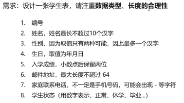
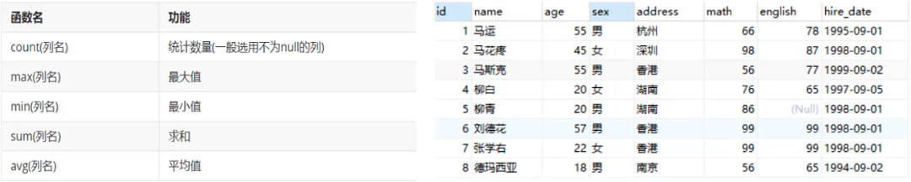

# 数据库相关概念

- 存储数据

## 数据库

- 存储数据的仓库，数据是有组织的进行存储
- 英文：DataBase，简称 DB

## 数据库管理系统

- 管理数据库的大型软件
- 英文：DataBase Management System，简称 DBMS

## SQL

- Structured Query Language
- SQL：结构化查询语言
- 操作关系型数据库的编程语言
- 定义操作所有关系型数据库的统一标准

## 常见的关系型数据库管理系统

- Oracle
- MySQL
- SQL Server
- PostgreSQL
- DB2
- SQLite
- MariaDB

# MySQL 数据模型

## 关系型数据库

- 建立在关系模型基础上的数据库
- 简单说，关系型数据库是由多张能互相连接的二维表组成的数据库
- 优点
	- 都是使用表结构，格式一致，易于维护
	- 使用通过 SQL 语言，使用方便，可用于复杂查询
	- 数据存储在磁盘中，安全

# SQL

## SQL 简介

- Structured Query Language
- SQL：结构化查询语言
- 操作关系型数据库的编程语言
- 定义操作所有关系型数据库的统一标准

## SQL 通用语法

## SQL 分类

- DDL (Data Definition Language) 数据定义语言, 用来定义数据库对象: 数据库, 表, 列

## DDL

- 操作数据库, 表等

```sql
-- 查看数据库
show
DataBase;
-- 创建
create
DataBase 数据库名称;
-- 创建数据库(判断, 如果不存在则创建)
create
DataBase if not exists 数据库名称;
-- 删除
-- 删除数据库
drop
DataBase 数据库名称;
drop DataBase if exists 数据库名称;
-- 使用数据库
-- 查看当前使用的数据库
select DataBase();
-- 使用数据库
use
数据库名称;
-- 创建表
create table 表名
(
    字段名 数据类型,
    字段名 数据类型,
    字段名 数据类型,
    字段名 数据类型,
    字段名 数据类型
)
-- 修改表名
alter table 表名 rename to 新表名;
-- 添加一列
alter table 表名 add 列名 数据类型;
-- 修改数据类型
alter table 表名 modify 列名 新数据类型;
-- 修改列名和数据类型
alter table 表名 change 列名 新列名 新数据类型;
-- 删除列
alter table 表名 drop 列名;
```

- 案例

  

  ```sql
  create table stus (
  id int,
  name varchar(10),
  gender varchar(1),
  birth date,
  score decimal(2,2),
  email varchar(64),
  homeCall varchar(20),
  status tinyint
  );
  ```

## DML

- 对表中的数据进行增删改
```sql
-- 添加
-- 给指定列添加数据
insert into 表名(列名1, 列名2, ...) values(值1, 值2, ...);
-- 给全部列添加数据
insert into 表名 values(值1, 值2, ...);
-- 批量添加数据
insert into 表名(列名1, 列名2, ...) values(值1, 值2, ...), (值1, 值2, ...)...;
insert into 表名 values(值1, 值2, ...), (值1, 值2, ...)...;

-- 修改
update 表名 set 列名1=值1, 列名2=值2, ...where 条件;
	-- 如果修改语句中不加条件, 则所有数据都将修改
```


## DQL

- 对表中的数据进行查询

```sql
-- 查询所有数据
select * from students;
```

```sql
-- 查询当前数据库下所有表名称
show
tables;
-- 查询表结构
desc 表名称;
```

- 查询语法

```sql
select 字段列表
from 表名列表
where 条件列表
group by 分组字段
having 分组后条件
order by 排序字段
limit 分页限定
```


### 基础查询和条件查询
```sql
-- 查询多个字段
select 字段列表 from 表名;
select * from 表名;
-- 去除重复记录
select distinct 字段列表 from 表名;
-- 起别名
as: as 也可以省略

-- 练习
-- 少用 * 号
SELECT * FROM stu;
select name, age from stu; 
select distinct address from stu;
select name as "姓名", math as "数学", english as "英语" from stu;
-- 查询年龄 大于 20岁的学员信息
select * from stu where age >= 20;
select * from stu where age between 20 and 30;
select * from stu where hire_date between '1998-09-01' and '1999-09-01'
-- 不等于 18 岁
select * from stu where age <> 18
select * from stu where age != 18;
-- 等于 18 或者等于 20, 或者 等于 22
select * from stu where age = 18 or age = 20 or age = 22;
select * from stu where age = 18 || age = 20 || age = 22;
select * from stu where age in (18, 20, 22);
-- 查询英语成绩为 null 的学院信息
-- 注意 null 值的比较不能使用 = != 比较, 需要使用 is is not
select * from stu where english is null;
select * from stu where english is not null;
-- 模糊查询 like
-- % 通配符
-- 查询姓马的学生信息
select * from stu where name like '马%';
-- 查询第二个字是花的学生信息
select * from stu where name like '_花%';
-- 查询名字包含德的学生信息
select * from stu where name like '%德%';
```

### 排序查询

- 排序查询语法

```sql
select 字段列表 from 表名 order by 排序字段名 [排序方式], 排序字段名2[排序方式2]...;
-- 排序方式
	-- ASC: 升序排列
	-- DESC: 降序排列
-- 如果有多个排序条件, 当前边条件值一样时, 才会根据第二条件进行排序

-- 查询学生信息, 按照年龄升序排列
select * from stu order by age ASC;
-- 查询学生信息, 按照数学成绩降序排列
select * from stu order by math DESC;
-- 查询学生信息, 按照数学成绩降序排列, 如果数学成绩一样, 再按照英语成绩升序排列
select * from stu order by math DESC, english ASC;
```

### 分组查询

- 将一列数据作为一个整体, 进行纵向计算
- 聚合函数分类



- 聚合函数语法
	- select 聚合函数名(列名) from 表;
	- null 值不参与所有聚合函数运算

```sql
-- count 统计数量
-- max 求最大值
-- min 求最小值
-- sum 求和
-- avg 求平均值

-- 统计班级一共有多少学生
select count(*) from stu;
-- 查询数学成绩最高分
select max(math) from stu;
-- 查询数学成绩最低分
select min(math) from stu;
-- 查询数学成绩的总分
select sum(math) from stu;
-- 查询数学成绩的平均分
select avg(math) from stu;
-- 查询英语成绩的最低分
select min(english) from stu;
```

- 分组查询语法
	- `select 字段列表 from 表名 where 分组前条件限定 group by 分组字段名 having 分组后条件过滤`
- 分组后查询的字段为分组字段, 和聚合函数, 其他无任何意义

```sql
-- 查询男同学女同学各自的数学平均分
select sex, avg(math) from stu group by sex;
-- 查询男同学女同学各自的数学平均分, 以及各自人数
select sex, avg(math), count(*) from stu group by sex;
-- 查询男同学女同学各自的数学平均分, 以及各自人数, 要求: 分数低于 70 分不参与分组
select sex, avg(math), count(*) from stu where math > 70 group by sex
-- 查询男同学女同学各自的数学平均分, 以及各自人数, 要求: 分数低于 70 分不参与分组, 分组之后人数大于 2 个
select sex, avg(math), count(*) from stu where math > 70 group by sex having count(*) > 2
```

### 分页查询
- 分页查询语法
	- `select 字段列表 from 表名 limit 起始索引, 查询条目数;`
- 起始索引: 从 0 开始
- 计算公式: 起始索引=(当前页码 - 1) * 每页显示的条数
- tips:
	- 分页查询 limit 是 mysql 数据库的方言
	- Oracle 分页查询使用 rownumber
	- SQL Server 分页查询使用 top

```sql
-- 从 0 开始查询, 查询 3 条数据
select * from stu limit 0, 3;
-- 每页显示 3 条数据, 查询第 1 页数据
select * from stu limit 0, 3;
-- 每页显示 3 条数据, 查询第 2 页数据
select * from stu limit 3, 3;
-- 每页显示 3 条数据, 查询第 3 页数据
select * from stu limit 6, 3;
```

## DCL

- 对数据库进行权限控制
