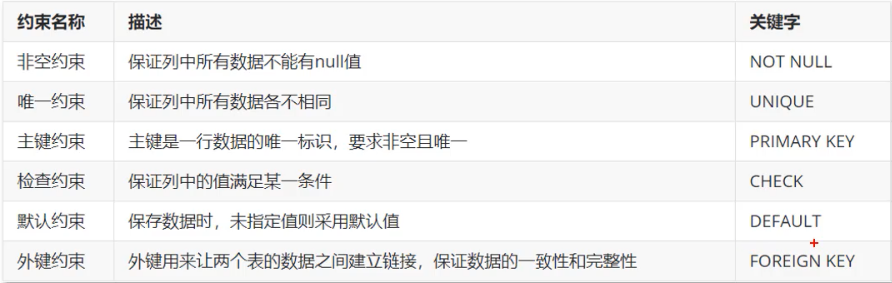
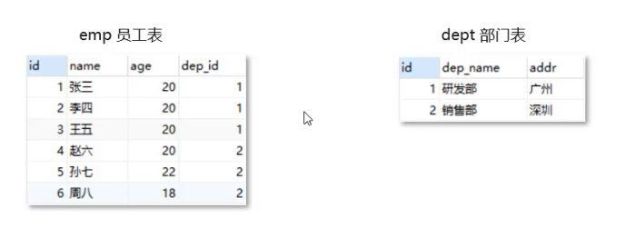
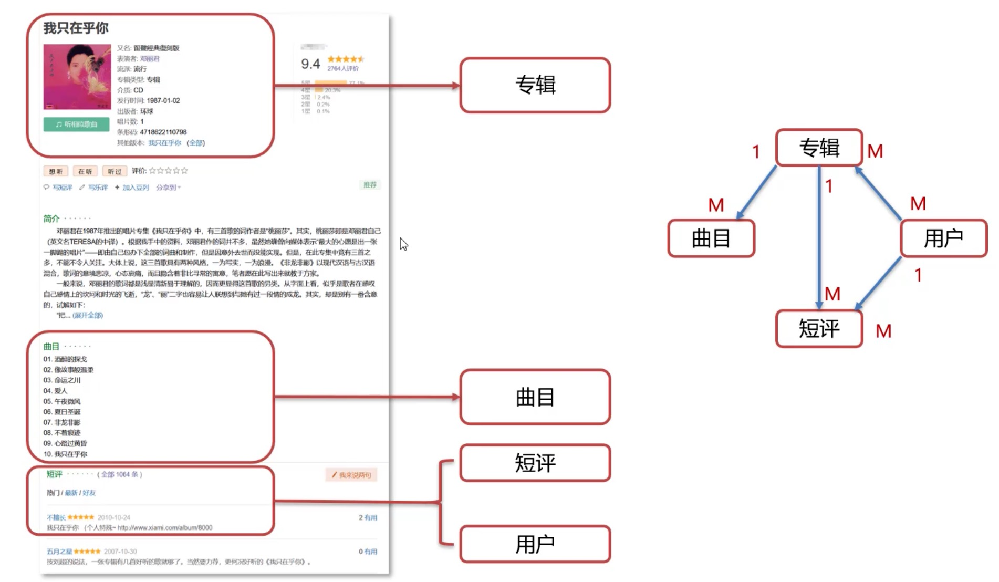

# Mysql 高级

## 约束

### 概念&分类

#### 约束的概念

- 约束是作用于表中列上的规则, 用于限制加入表的数据
- 约束的存在保证了数据库中数据的正确、有效性和完整性

#### 约束的分类



```sql
-- 创建员工表
create table emp
(
    id       int PRIMARY KEY auto_increment, -- 员工 id, 唯一且自增长
    ename    varchar(50) NOT NULL UNIQUE,    -- 员工姓名, 非空且唯一
    joindate date        NOT NULL,           -- 入职日期, 非空
    salary   double(7, 2
) NOT NULL, -- 工资, 非空
bonus double(7,2) DEFAULT 0 -- 奖金, 如果没有奖金默认为 0
);
-- 插入数据
INSERT INTO emp(id, ename, joindate, salary, bonus)
values (1, '张三', '1999-11-01', 8800, 5000);
-- 演示主键约束，非空且唯一
insert into emp
values (1, '李四', '1999-11-11', 9900, 4000);
insert into emp
values (null, '张三', '1999-11-11', 9900, 4000);
insert into emp
values (2, '李四', '1999-11-11', 9900, 4000);
-- 演示非空约束
insert into emp
values (3, null, '1999-11-11', 9900, 4000);
-- 演示唯一约束
insert into emp
values (4, '李四', '1999-11-11', 9900, 4000);
-- 演示默认约束
-- 不给字段添加任何值的时候生效
insert into emp
values (5, '王武', '1999-11-11', 9900);
-- 演示自动增长 auto_increment: 当列是数字类型并且 唯一约束
insert into emp
values (1, '张三', '1999-11-01', 8800, 5000);
insert into emp
values (null, '李四', '1999-11-01', 8800, 5000);
insert into emp
values (null, '王五', '1999-11-01', 8800, 5000);
insert into emp(ename, joindate, salary, bonus)
values ('赵六', '1999-11-11', 8800, null);
```

- 外键约束
	- 用来让两个表的数据之间建立链接，保证数据的一致性和完整性
	  
- 语法
	- 添加约束

```sql
-- 在创建表时添加约束
create table 表名(
    列名 数据类型,
    ...
    constraint 外键名称 foreign key (外键列名) references 主表(主表列名)
)
-- 在建表完成后添加约束
alter table emp add constraint foreign key dep_id references dept(id);
-- 删除约束
alter table emp drop foreign key dep_id;
```

```sql
-- 创建部门表
create table dept (
    id int primary key auto_increment,
    dep_name varchar(20) not null,
    addr varchar(20) not null
);
create table emp (
    id int primary key auto_increment,
    name varchar(20),
    age int,
    dep_id int
	-- 添加外键
	constraint fk_emp_dep_id foreign key(dep_id) references dept(id);
);
```

## 数据库设计
### 简介
- 软件研发步骤
- 数据库设计概念
	- 数据库设计就是根据业务系统的具体需求,结合我们所选用的DBMS,为这个业务系统构造出最优的数据存储模型
	- 建立数据库中的表结构以及表与表之间的关联关系的过程
	- 有哪些表?表里有哪些字段?表和表之间有什么关系?

- 数据库设计的步骤
	- 需求分析(数据是什么?数据具有哪些属性?数据与属性的特点是什么?)
	- 逻辑分析(通过ER图对数据库进行逻辑建模,不需要考虑我们所选用的数据库管理系统)
	- 物理设计(根据数据库自身的特点把逻辑设计转换为物理设计)
	- 维护设计(1.对新的需求进行建表;2.表优化)

### 表关系
#### 一对一
- 用户对用户详情
- 多用于表拆分
- 一个人一个身份证, 一个身份证, 一个人

#### 一对多
- 一对多(多对一)
	- 部门对员工
	- 一部门对多员工
	- 多员工对一个部门

#### 多对多
- 多对多
	- 商品和订单
	- 一个商品对应多个订单, 一个订单对应多个商品

- 实现方式:建立第三张中间表

```sql
create table tb_order (
id int primary key auto_increment,
payment double,
payment_type varchar(10),
status varchar(5)
);
create table tb_goods (
id int primary key auto_increment,
title varchar(50),
price double
);
create table tb_order_goods (
id int primary key auto_increment,
order_id int, goods_id int,constraint fk_order_id foreign key(order_id) references tb_order(id),
constraint fk_goods_id foreign key(goods_id) references tb_goods(id),
count int default 1
);
```

#### 数据库设计案例



```sql
create table user (
id int primary key auto_increment,
nickname varchar(20),
description varchar(50),
);

create table user_album (
id int primary key auto_increment,
user_id int,
album_id int,
constraint fk_user_id foreign key(user_id) references user(id),
constraint fk_album_id foreign key(album_id) references albums(id)
);

create table comments (
id int primary key auto_increment,
user_id int,
album_id int,
comment varchar(255),
constraint fk_user_id foreign key(user_id) references user(id),
constraint fk_album_id foreign key(album_id) references albums(id)
);

create table user_comments (
id int primary key auto_increment,
user_id int,
album_id int,
comment_id int,
constraint fk_user_id foreign key(user_id) references user(id),
constraint fk_album_id foreign key(album_id) references albums(id),
constraint fk_comment_id foreign key(comment_id) references comments(id)
);

create table albums (
id int primary key auto_increment,
description varchar(255),
date datetime,
song_id int,
comment int,
constraint fk_song_id foreign key(song_id) references songs(id)
);

create table songs (
id int primary key auto_increment,
name varchar(100),
description varchar(255)
);
```

## 多表查询
### 简介

- 连接查询
	- 内连接: 相当于查询AB交集数据
	- 外连接
		- 左外连接:相当于查询A表所有数据和交集部分数据
		- 右外连接:相当于查询B表所有数据和交集部分数据
	- 子查询

```sql
-- 多表查询
select * from emp, dept order by dept_name;

+----+------+-----+--------+----+----------+------+
| id | name | age | dep_id | id | dep_name | addr |
+----+------+-----+--------+----+----------+------+
| 1  | 张三 | 20  | 1      | 1  | 研发部   | 广州 |
| 2  | 李四 | 20  | 1      | 1  | 研发部   | 广州 |
| 3  | 王五 | 20  | 1      | 1  | 研发部   | 广州 |
| 4  | 赵六 | 20  | 2      | 1  | 研发部   | 广州 |
| 5  | 孙七 | 22  | 2      | 1  | 研发部   | 广州 |
| 6  | 周八 | 18  | 2      | 1  | 研发部   | 广州 |
| 1  | 张三 | 20  | 1      | 2  | 销售部   | 深圳 |
| 2  | 李四 | 20  | 1      | 2  | 销售部   | 深圳 |
| 3  | 王五 | 20  | 1      | 2  | 销售部   | 深圳 |
| 4  | 赵六 | 20  | 2      | 2  | 销售部   | 深圳 |
| 5  | 孙七 | 22  | 2      | 2  | 销售部   | 深圳 |
| 6  | 周八 | 18  | 2      | 2  | 销售部   | 深圳 |
+----+------+-----+--------+----+----------+------+
-- 笛卡尔积: 有 A、B 两个集合, 取 A、B 所有的组合情况
-- 查询 emp 和 dept 的数据, emp.dep_id = dept.id
select * from emp, dept order by emp.dep_id = dept.id;
```

### 内连接
- 基本语法
```sql
-- 隐式内连接
select 字段列表 from 表1, 表2... where 条件;

select * from emp, dept order by emp.dep_id = dept.id;
-- 显示部分数据
select emp.name, emp.age, dept.dep_name from emp, dept where dep_id=dept.id;

-- 显示内连接
select 字段列表 from 表1 [inner] join 表2 on 条件;

select * from emp inner join dept on dept.id = emp.dep_id;

+----+------+-----+--------+----+----------+------+
| id | name | age | dep_id | id | dep_name | addr |
+----+------+-----+--------+----+----------+------+
| 1  | 张三 | 20  | 1      | 1  | 研发部   | 广州 |
| 2  | 李四 | 20  | 1      | 1  | 研发部   | 广州 |
| 3  | 王五 | 20  | 1      | 1  | 研发部   | 广州 |
| 4  | 赵六 | 20  | 2      | 2  | 销售部   | 深圳 |
| 5  | 孙七 | 22  | 2      | 2  | 销售部   | 深圳 |
| 6  | 周八 | 18  | 2      | 2  | 销售部   | 深圳 |
+----+------+-----+--------+----+----------+------+
```

### 外连接

```sql
-- 左外连接
-- 相当于查询A表所有数据和交集部分数据
-- 查询 emp 表所有数据和对应的所有信息
select 字段列表 from 表1 left [outer] join 表2 on 条件;
select * from emp left outer join dept on emp.dept_id = dept.id;
-- 右外连接
-- 相当于查询B表所有数据和交集部分数据
select 字段列表 from 表1 right [outer] join 表2 on 条件;
select * from dept right outer join emp on emp.dept_id = dept.id;
```

### 子查询

```sql
-- 查询工资高于猪八戒的员工信息
select salary from emp where ename = "猪八戒";
select * from emp where salary > (select salary from emp where ename = "猪八戒");
-- 子查询
-- 单行单列: 作为条件值, 使用 = != > < 等进行条件判断
select 字段列表 from 表 where 字段名 = (子查询);
-- 多行单列 用 in 多结果查询
select 字段列表 from 表 where 字段名 in (子查询);
-- 多行多列: 作为虚拟表
select 字段列表 from (子查询) where 字段名 in (子查询);
```

### 案例

```sql
-- 查询所有员工信息, 查询员工编号, 员工姓名, 工资, 职务名称, 职务描述
select emp.id, ename, salary, job.jname, job.description from emp, job where emp.job_id = job.id;
-- 查询员工编号, 员工姓名, 工资, 职务名称, 职务描述, 部门名称, 部门位置
select tp.id, ename, salary, jname, description, dept.dname, dept.loc from (select emp.id, ename, salary, job.jname, job.description, dept_id from emp, job where emp.job_id = job.id) tp, dept where tp.dept_id = dept.id;
select emp.id, ename, salary, job.jname, job.description, dept.dname, dept.loc from emp, job, dept where emp.job_id = job.id and emp.dept_id = dept.id;
-- 查询员工姓名, 工资, 工资等级
select ename, salary, salarygrade.grade from emp join salarygrade on salary > losalary and salary < hisalary;
-- 查询员工姓名, 工资, 职务名称, 职务描述, 部门名称, 部门位置, 工资等级
select ename, salary, job.jname, job.description, dept.dname, dept.loc, salarygrade.grade from emp, job, dept, salarygrade where emp.dept_id=dept.id and job_id=job.id and salary >= losalary and salary <= hisalary;
	-- 显式内连接
select ename, salary, job.jname, job.description, dept.dname, dept.loc, salarygrade.grade from emp join dept on emp.dept_id=dept.id join job on job_id=job.id join salarygrade on salary >= losalary and salary <= hisalary;
-- 查询部门编号、部门名称、部门位置、部门人数
select dept.id, dept.dname, dept.loc, count(*) from dept join emp on emp.dept_id=dept.id group by dept.id;
```

## 事务
### 事务简介
- 数据库的事务是一种机制、一个操作序列、包含了一组数据库操作命令
- 事务把所有命令作为一个整体一起向系统提交或撤销操作请求, 即一组数据库命令要么同时成功, 要么同时失败
- 事务是一个不可分割的工作逻辑单元

```sql
-- 事务
start transaction;
-- 或者
begin;
-- 提交事务
commit;
-- 回滚事务
rollback;

MySQL root@(none):db1> create table account (
                    -> id int primary key auto_increment,
                    -> name varchar(10),
                    -> money decimal(10,2)
                    -> );

MySQL root@(none):db1> insert into account(name,money) values('张三', 500),('李四', 1000);
Query OK, 2 rows affected
Time: 0.045s
MySQL root@(none):db1> select * from account;
update account set money = 1000;
-- 开启事务
begin;
update account money = money - 500 where name = '李四';
出错了...
update account money = money + 500 where name = '张三';

rollback;
```

### 事务四大特征

| 特征                | 解释                                                     |
|---------------------|----------------------------------------------------------|
| 原子性(Atomicity)   | 事务是不可分割的最小操作单位, 要么同时成功, 要么同时失败 |
| 一致性(Consistency) | 事务完成时,必须使所有数据都保持一致状态                  |
| 隔离性(Isolation)   | 多个事务之间,操作的可见性                                |
| 持久性(Durability)  | 事务一旦提交,它对数据库的数据的改变就是永久的            |

```sql
-- 查询事务的默认提交方式
select @@autocommit;
-- 修改提交方式为手动提交
set @@autocommit = 0;
-- commit 
commit;
-- 回滚
rollback;
```
