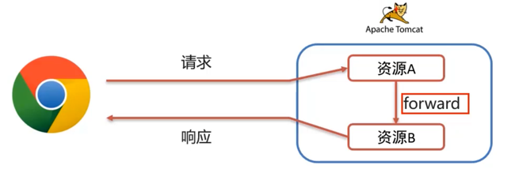

# Request & Response

## Request

- Request：获取请求数据

### Request 继承体系

- ServletRequest
- HttpServletRequest
- RequestFacade
	- Tomcat 实现

### Request 获取请求数据

- 请求数据分为三部分
	- 请求行
		- String getMethod() 获取请求方式
		- String getContextPath() 获取虚拟目录（项目访问路径）：/request-demo
		- StringBuffer getRequestURL() 获取URL（统一资源定位符）：http://localhost:8080/request-demo/req1
		- String getRequestURI() 获取URI（统一资源标识符）：/request-demo/req1
		- String getQueryString() 获取请求参数（GET方式）：username=zhangsan&password=123
	- 请求头
		- String getHeader(String name): 根据请求头名称，获取值
	- 请求体
		- ServletInputStream getInputStream(): 获取字节输入流
		- BufferedReader getReader(): 获取字符输入流

- 通用方式获取请求参数
	- Map<String, String> getParameterMap(): 获取所有参数 Map 集合
	- String[] getParameterValues(String name): 根据名称获取参数值（数组）
	- String getParameter(String name): 根据名称获取参数值（单个值）
- 使用通用方法获取请求参数后，屏蔽了GET和POST的请求方式代码不同，则代码可以定义为如下格式
	- [通用方法获取请求参数](Request-Demo/src/main/java/com/itheima/web/RequestDemo2.java)
- 可以使用 Servlet 模版创建 Servlet 更高效

- Request 请求参数中文乱码处理
	- 请求参数如果存在中文数据，则会乱码
	- 解决方案：
		- POST：设置输入流的编码
		- `request.setCharacterEncoding("UTF-8");`
		- 解决不了GET请求方式的中文乱码问题
	- 解决GET请求方式的中文乱码问题
		- URL 编码
			- 将字符串按照编码方式转换为二进制
			- 每个字节转为2个16进制数并在前面加上%
		- [URL解码](Request-Demo/src/main/java/com/itheima/web/URLDemo.java)
- Tomcat 在 8 之后将默认解码换成 UTF-8 解决了中文乱码

- 总结：
	- 如果是GET
		- 设置输入流编码
		- request.setCharacterEncoding("UTF-8")
	- 通用方式（GET/POST）：先解码，再编码
		- new String(username.getBytes("ISO-8859-1"), "UTF-8")
	- URL 编码方式实现
		- 编码：URLEncoder.encode(str, "UTF-8")
		- 解码：URLEncoder.decode(str, "ISO-8859-1")

### Request 请求转发

- 请求转发：一种在服务器内部的资源跳转方式
  
- 实现方式：
	- `request.getRequestDispatcher("资源B路径").forward(request, response)`
- 请求转发之间共享数据：使用 Request 对象
	- void setAttribute(String name, Object o)：存储数据到 request 域中
	- Object getAttribute(String name)：根据 key，获取值
	- void removeAttribute(String name)：根据 key，删除该键值对
- 请求转发特点
	- 浏览器地址栏不发生变化
	- 只能转发到当前服务器的内部资源
	- 一次请求，可以在转发的资源间使用request共享数据